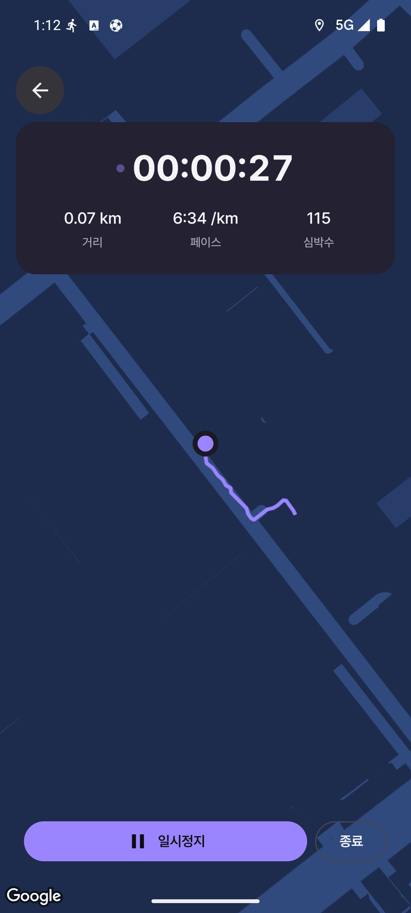
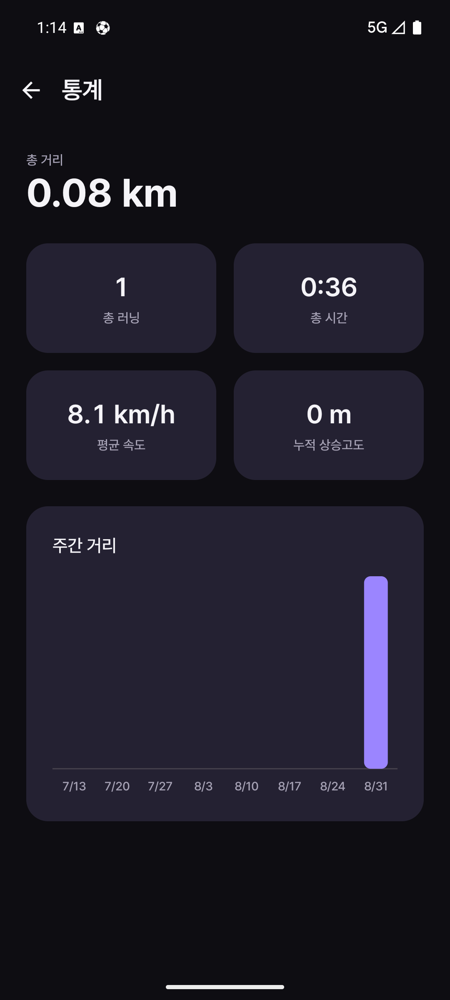
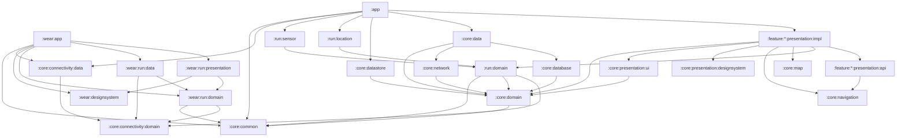

# TodayRun

달린 기록을 남기는 안드로이드 러닝 앱입니다. 폰에서 GPS로 실시간 추적하고, 페어링된 Wear OS 워치에서 같은 러닝을 조작할 수 있습니다.

## 화면

정리해서 올릴 예정입니다.

<!--
캡처와 영상은 assets/ 에 넣고 아래 주석을 풀면 됩니다.

| 러닝 히스토리 | 실시간 추적 | 상세 | 통계 | 워치 |
|---|---|---|---|---|
|  |  |  |  |  |
-->

## 기능

**폰**

- GPS 실시간 추적. 거리, 페이스, 경과 시간, 고도, 걸음 수를 기록합니다.
- 포그라운드 서비스로 화면을 꺼도 추적이 이어집니다.
- 진행 중인 러닝을 임시 저장합니다. 앱이 종료돼도 러닝 화면에 다시 들어가면 이어서 할지 물어봅니다.
- 저장 시점의 날씨를 함께 남기고, 실패하면 나중에 백그라운드에서 채웁니다.
- 지도 위 경로, 1km 단위 구간 기록, 지도 SDK 없이 그리는 경로 썸네일.
- 러닝 목록, 스와이프 삭제와 되돌리기.
- 누적 통계와 최근 주간 거리 차트.
- 홈 화면 위젯, 주간 요약 알림.
- 한국어/영어, 라이트·다크 테마, km/mile 전환.

**워치**

- 워치에서 시작·일시정지·종료를 조작하고, 폰과 상태가 양방향으로 동기화됩니다.
- Health Services로 심박수를 측정해 폰으로 보냅니다.
- 타일에서 바로 러닝 화면으로 들어갑니다.

## 기술 스택

| 영역     | 사용                                                             |
|--------|----------------------------------------------------------------|
| UI     | Jetpack Compose                                                |
| 내비게이션  | Navigation 3                                                   |
| DI     | Koin                                                           |
| 로컬 저장소 | Room, Paging 3, DataStore                                      |
| 네트워크   | Ktor Client, serialization                                     |
| 백그라운드  | WorkManager, 포그라운드 서비스                                         |
| 지도     | Google Maps Compose / Kakao Map                                |
| 위젯     | Glance                                                         |
| 워치     | Wear Compose, Health Services, Wear Tiles, Wearable Data Layer |

## 아키텍처

```
:app
:wear:app

:core:common
:core:domain
:core:data
:core:database
:core:datastore
:core:network
:core:navigation
:core:map
:core:connectivity:domain
:core:connectivity:data
:core:presentation:designsystem
:core:presentation:ui

:feature:onboarding:presentation:{api,impl}
:feature:overview:presentation:{api,impl}
:feature:active:presentation:{api,impl}
:feature:details:presentation:{api,impl}
:feature:stats:presentation:{api,impl}
:feature:settings:presentation:{api,impl}

:run:domain
:run:location
:run:sensor

:wear:designsystem
:wear:run:domain
:wear:run:data
:wear:run:presentation
```



### Q. core에는 어떤 기준으로 모듈을 넣었나요?

core에 들어간 모듈은 세 부류입니다.

**하나. 라이브러리 하나씩을 맡은 모듈.** `core:network`는 Ktor를, `core:database`는 Room을, `core:datastore`는
DataStore를, `core:map`은 지도 SDK를, `core:connectivity:data`는 Wearable Data Layer를 안고 있습니다. 이 모듈을 지웠을 때
프로젝트에서 사라지는 라이브러리가 있으면 그 라이브러리를 위한 모듈로 봤습니다. 그래서 Ktor를 보는 건 `core:network`와 그걸 부르는 `core:data`뿐이고,
화면 모듈에는 Ktor가 딸려오지 않습니다.

**둘. 여러 모듈이 같이 쓰는 코드.** `core:presentation:designsystem`과 `core:presentation:ui`는 폰의 모든 화면이 쓰고,
`core:navigation`은 모든 `api` 모듈이 씁니다. `core:common`의 `Result`와 `DispatcherProvider`는 화면과 데이터 양쪽에서
씁니다.

**셋. 한 곳에만 있어야 하는 데이터.** `core:domain`의 `Run`과 `RunRepository`입니다. 러닝 기록은 active가 쓰고 overview·details·stats가
읽습니다. 어느 한 화면이 소유하면 나머지 셋이 그 화면을 의존하게 됩니다.

그리고 `core:domain`, `run:domain`, `core:connectivity:domain`은 안드로이드 의존이 없는 순수 Kotlin 모듈입니다. 도메인에서
`Context`를 쓰려고 하면 컴파일이 깨집니다.

### Q. `api` / `impl`은 무슨 역할인가요?

다른 모듈에 공개하는 부분과 화면 구현을 갈라 놓은 것입니다.

`api`에는 화면을 가리키는 키만 있습니다.

```kotlin
@Serializable
data class RunDetailNavKey(
    val runId: String,
) : NavKey
```

키 선언이 전부고, 의존성도 `core:navigation` 하나뿐입니다. `core:navigation`은 `Navigator`와 `navigation3-runtime`만 들고
있어서 Compose UI가 딸려오지 않습니다. 그래서 다른 피처의 `api`를 참조하는 비용이 거의 없습니다.

`impl`에는 화면과 ViewModel이 있고 전부 `internal`입니다. 밖으로 나가는 건 Koin 모듈 하나뿐입니다.

그래서 overview는 다른 화면 넷으로 이동하면서도 그쪽 `api`만 봅니다. 피처 의존성이 이게 전부입니다.

```kotlin
implementation(project(":feature:active:presentation:api"))
implementation(project(":feature:details:presentation:api"))
implementation(project(":feature:stats:presentation:api"))
implementation(project(":feature:settings:presentation:api"))
```

`api` 모듈은 어떤 `impl`에도 의존하지 않으므로 서로 오가는 화면이 있어도 순환이 생기지 않습니다.

화면 등록은 Koin이 합니다. 각 `impl`이 자기 Koin 모듈 안에서 NavKey와 화면을 묶습니다.

```kotlin
val overviewPresentationModule =
    module {
        viewModelOf(::OverviewViewModel)
        navigation<OverviewNavKey> {
            val navigator = get<Navigator>()
            OverviewScreenRoot(
                onStartRun = { navigator.navigateTo(ActiveRunNavKey) },
                onOpenRun = { runId -> navigator.navigateTo(RunDetailNavKey(runId)) },
                onOpenStats = { navigator.navigateTo(StatsNavKey) },
                onOpenSettings = { navigator.navigateTo(SettingsNavKey) },
            )
        }
    }
```

`:app`의 `NavDisplay`는 `entryProvider = koinEntryProvider<NavKey>()` 한 줄로 끝납니다. 화면이 늘어도 앱 모듈의 내비게이션
코드는 그대로입니다. 새 피처를 추가할 때 앱 모듈에서 할 일은 모듈 의존성을 걸고 Koin 모듈을 등록하는 것뿐입니다.

### Q. `core:data`는 왜 따로 뒀나요?

리포지토리는 여러 기술이 만나는 자리이기 때문입니다. 러닝 저장 하나가 세 가지를 동시에 건드립니다.

```kotlin
override suspend fun upsertRun(
    run: Run,
    mapPicture: ByteArray,
): EmptyResult<DataError.Local> =
    applicationScope
        .async {
            val mapPicturePath = runMapStorage.savePicture(mapPicture)
            val localResult = localRunDataSource.upsertRun(run, mapPicturePath)
            if (localResult is Result.Success && run.weather == null) {
                weatherBackfillScheduler.scheduleBackfill(localResult.data)
            }
            localResult.asEmptyResult()
        }.await()
```

파일 IO, Room, WorkManager가 한 함수에 있습니다. 이걸 `core:database`에 두면 DB 모듈이 WorkManager를 알게 됩니다. 그래서
`core:database`와 `core:network` 위에 `core:data`를 따로 뒀습니다.

### Q. connectivity는 왜 core로 뺐나요?

`:app`과 `:wear:app`은 서로 다른 APK입니다. 프로세스도 다르고 DI 그래프도 다릅니다. 그런데 둘은 같은 프로토콜로 대화해야 합니다. 워치에서 일시정지를 누르면
폰도 같이 멈춰야 하고, 폰에서 러닝을 끝내면 워치도 같이 끝나야 합니다.

프로토콜을 양쪽에 각각 두면 결국 갈라집니다. 한쪽에 액션을 추가하면서 다른 쪽 인코딩을 안 고치면, 보내긴 보내는데 받는 쪽이 알아듣지 못합니다. 그래서 주고받을 말은
`core:connectivity:domain`에, Wearable Data Layer를 쓰는 구현은 `core:connectivity:data`에 뒀습니다. 두 모듈 다 폰 앱과
워치 앱이 함께 씁니다.

얻은 건 아래와 같습니다.

**프로토콜이 한 군데입니다.** `MessagingAction`은 sealed interface고, 폰과 워치가 같은 타입을 씁니다. 액션을 하나 추가하면
`core:connectivity:data`의 DTO 매퍼와 큐 정책 `when`이 컴파일 에러를 냅니다. 전송 포맷과 큐잉 규칙을 정하지 않고는 빌드가 안 됩니다. 반면 화면 쪽
`when`에는 `else`를 뒀습니다. 구버전 앱이 모르는 액션을 받아도 무시하고 넘어가야 하기 때문입니다.

**전송 포맷도 한 군데입니다.** 도메인 모델과 DTO를 분리하고 DTO에 `@SerialName`으로 키를 고정해 뒀습니다. 도메인 쪽 이름을 리팩터링해도 전송 포맷은 흔들리지
않습니다.

**기기 탐색 코드도 한 군데입니다.** 폰은 워치를 찾고 워치는 폰을 찾는데, 방향만 뒤집힌 같은 일입니다.

```kotlin
internal fun remoteCapabilityFor(localDeviceType: DeviceType): String =
    when (localDeviceType) {
        DeviceType.PHONE -> CAPABILITY_WEAR_APP
        DeviceType.WATCH -> CAPABILITY_PHONE_APP
    }
```

`WearNodeDiscovery`에 넘기는 `DeviceType`만 바뀌고, 나머지는 양쪽이 같은 코드를 씁니다.

공유한 건 프로토콜까지고, 기기별 어댑터는 각자 앱 쪽에 남겼습니다. 폰의 `PhoneToWatchConnector`는 `run:location`에 있고 `run:domain`의
`WatchConnector`를 구현합니다. 워치의 `WatchToPhoneConnector`는 `wear:run:data`에 있고 `wear:run:domain`의
`PhoneConnector`를 구현합니다.

연결이 끊겼을 때는 못 보낸 액션을 큐에 넣었다가 다시 이어지면 보냅니다. 다만 아무거나 넣지는 않습니다.

```kotlin
private fun MessagingAction.isWorthQueueing(): Boolean =
    when (this) {
        MessagingAction.StartOrResume,
        MessagingAction.Pause,
        MessagingAction.Finish,
        MessagingAction.ConnectionRequest,
        MessagingAction.Trackable,
        MessagingAction.Untrackable,
            -> true

        is MessagingAction.HeartRateUpdate,
        is MessagingAction.StepCountUpdate,
        is MessagingAction.DistanceUpdate,
        is MessagingAction.TimeUpdate,
            -> false
    }
```

시작·정지 같은 제어 액션은 늦게라도 도착해야 양쪽 상태가 맞습니다. 반면 심박수나 거리는 뒤늦게 도착하면 화면이 과거 값으로 되돌아갑니다. 그래서 제어 액션만 큐에
넣고 나머지는 버리도록 했습니다.

### Q. `run:*`은 왜 `feature:active` 안에 있지 않나요?

수명이 다르기 때문입니다. `RunningTracker`는 `applicationScope`에서 돌고, 화면이 사라져도 포그라운드 서비스와 함께 계속 위치를 모읍니다.
`feature:active`는 그걸 구독해서 그리는 화면입니다.

안쪽도 안드로이드가 필요한 부분을 기준으로 갈랐습니다. `run:domain`은 위치와 센서를 인터페이스로만 들고 있고, Play Services와 센서를 쓰는 구현은
`run:location`과 `run:sensor`에 있습니다. 그래서 거리와 페이스를 계산하는 코드가 순수 Kotlin 모듈에 남습니다. 워치 쪽도 같은 모양으로
`wear:run:domain`과 `wear:run:data`로 갈라 두었습니다.

### Q. 지도는 왜 빌드 플레이버로 나눴나요?

구글 지도와 카카오 지도를 둘 다 지원하는데, 인터페이스를 만들고 DI로 갈아 끼우는 대신 프로덕트 플레이버를 썼습니다.

```
core/map/src/main/    공용 타입과 경로 썸네일 렌더링
core/map/src/google/  MapView (Google Map)
core/map/src/kakao/   MapView (Kakao Map)
```

두 소스셋이 같은 시그니처의 `MapView(state: RunMapState, modifier: Modifier)`를 각각 선언합니다. 지도를 그리는 화면은
`MapView(...)`를 부를 뿐, 뒤에 무슨 SDK가 있는지 알지 못합니다.

DI가 아니라 플레이버를 고른 이유는 APK에 SDK 하나만 들어가게 하기 위해서입니다. 런타임 분기로 하면 두 SDK가 모두 패키징됩니다. 카카오 쪽은 `abiFilters`로
ABI를 제한해야 하는데, 플레이버로 나누면 그 설정이 kakao 쪽에만 붙습니다.

목록에 뜨는 경로 썸네일은 지도 SDK를 쓰지 않습니다. `RouteProjection`이 위경도를 캔버스 좌표로 투영하고 `Canvas`로 직접 PNG를 그립니다. 위도에 따라
경도 간격이 줄어드는 것까지 보정하기 때문에, 어느 플레이버로 빌드하든 썸네일이 똑같고 지도 타일 요청도 필요 없습니다.

## UI 레이어 아키텍처 패턴

단방향 데이터 흐름(UDF)을 따릅니다. 상태는 ViewModel에서 내려가고 이벤트는 화면에서 올라갑니다. 화면 하나는 `XScreenRoot`과 `XScreen`으로
나눴습니다. Root가 ViewModel과 이벤트 구독, 권한 런처처럼 안드로이드에 묶인 것을 맡고, `XScreen`은 상태와 람다만 받는 무상태 컴포저블이라 프리뷰가 그대로
뜹니다.

### Q. MVVM인가요, MVI인가요?

특정 패턴 하나를 프로젝트 전체에 강제하지 않았습니다. 화면의 특성에 따라 필요한 방식을 선택했습니다.

상태는 전 화면을 같게 뒀습니다. 화면당 불변 객체 하나를 두고 ViewModel만 그걸 바꿉니다. 동작 받는 방식은 갈랐습니다. 워치의 `TrackerViewModel`은
`onAction(TrackerAction)` 하나로 받고, 폰의 ViewModel은 `onToggleRun()`, `onDeleteRun()`처럼 함수로 받습니다.

상태를 바꾸는 코드는 워치도 한 곳에 모으지 않았습니다. `onAction`의 `when`에서 바꾸는 것과, 심박수나 거리처럼 Flow를 구독하며 바꾸는 것이 따로 있습니다.

[앱 아키텍처 가이드](https://developer.android.com/topic/architecture?hl=ko)와
[UI 레이어 가이드](https://developer.android.com/topic/architecture/ui-layer?hl=ko)는 패턴 이름 대신 아키텍처 원칙을 강조합니다.
이름을 무엇으로 부를지 정하기보다, 구현은 화면에 맞게 가져가되 원칙은 일관되게 지키는 것을 목표로 했습니다.

### Q. Action은 왜 워치 화면에만 있나요?

sealed Action은 공짜가 아니기 때문입니다. 인텐트마다 타입 하나와 `when` 분기 하나가 늘어납니다. 그래서 그게 필요한 화면에만 뒀습니다.

워치 화면은 같은 인텐트가 두 곳에서 들어옵니다. 워치 버튼에서도 오고, 폰이 Data Layer로 보낸 메시지에서도 옵니다. 받은 걸 그대로 되돌려 보내면 두 기기가 같은 액션을
끝없이 주고받습니다.

```kotlin
fun onAction(action: TrackerAction) {
    onAction(action, triggeredOnPhone = false)
}

private fun onAction(
    action: TrackerAction,
    triggeredOnPhone: Boolean,
) {
    if (!triggeredOnPhone) {
        sendActionToPhone(action)
    }
    when (action) {
        TrackerAction.OnToggleRunClick -> {
            if (state.isTrackable) {
                state = state.copy(isRunActive = !state.isRunActive)
            }
        }
    }
}
```

"적용은 하되 출처가 폰이면 되돌려 보내지 않는다"가 한 자리에서 끝납니다. 진입점이 하나로 모이지 않았다면 함수마다 같은 플래그를 반복해야 합니다.

폰 화면은 워치에서 오는 인텐트가 토글과 종료 둘뿐이라, 그 두 함수에 `triggeredByWatch` 플래그를 두는 것으로 충분했습니다. 나머지 인텐트는 진입점이 화면
하나뿐이라 이름 붙은 함수로 뒀습니다.

상태를 보고 표시 규칙만 정하는 판단은 `TrackerScreenRules`로 빼서 ViewModel 없이 테스트할 수 있게 했습니다. `canFinishRun(state)`,
`permissionToAsk(state)` 같은 순수 함수들입니다.

### Q. 상태는 왜 화면당 하나로 묶었나요?

실시간 추적 화면은 위치, 러닝 데이터, 경과 시간이 서로 다른 Flow에서 들어오고, 여기에 러닝 단계와 이어하기 다이얼로그 표시 여부가 더해집니다. 하나로 묶으면 어떤
조합이 가능한지 파일 하나만 보면 됩니다.

```kotlin
internal data class ActiveRunState(
    val runPhase: RunPhase = RunPhase.NotStarted,
    val elapsedTime: Duration = Duration.ZERO,
    val runData: RunData = RunData(),
    val currentLocation: Location? = null,
    val showResumePrompt: Boolean = false,
)

internal sealed interface RunPhase {
    data object NotStarted : RunPhase
    data object Tracking : RunPhase
    data object Paused : RunPhase
    data object Saving : RunPhase
    data object Finished : RunPhase
}
```

러닝 단계는 불리언을 나열하지 않고 `RunPhase` 하나로 뒀습니다. 단계를 빠짐없이 다뤄야 하는 곳에는 `when`에 `else`를 두지 않았기 때문에, 단계를
추가하면 거기서 컴파일이 깨집니다.

화면 모드 자체도 타입으로 나눴습니다. 통계 화면은 `Loading` / `Empty` / `Content`, 상세 화면은 `Loading` / `NotFound` /
`Content`입니다. "로딩은 끝났는데 데이터가 비었나"를 화면에서 다시 판단할 일이 없습니다.

### Q. 일회성 이벤트는 왜 상태로 안 두나요?

스낵바, 화면 이동, 권한 요청은 화면의 모습이 아니라 한 번 일어나는 일이라 상태에 두지 않았습니다.

버퍼 없는 `Channel`로 보내고 `ObserveAsEvents`가 `repeatOnLifecycle(STARTED)`에서 받습니다. 수신자가 없으면 `send`가 그 자리에서
정지하기 때문에, 화면이 백그라운드에 있는 동안에는 이벤트가 대기합니다. 대신 소비자가 하나뿐이라는 제약이 생깁니다. 메시지는 `UiText`로 감싸서 ViewModel이
`Context`를 모르게 했습니다.

## 오프라인과 복구

**러닝은 화면이 사라져도 저장됩니다.** 러닝을 저장하고 지우고 되돌리는 작업은 `applicationScope.async { }.await()`를 거칩니다. 저장 도중 화면이
사라져도 `viewModelScope`와 함께 취소되지 않습니다.

**날씨는 늦게라도 채웁니다.** 저장 시점에 10초 타임아웃으로 날씨를 조회하고, 날씨가 비어 있으면 그대로 저장한 뒤 워커를 예약합니다. 워커는 일시적인 네트워크 오류일 때만
재시도하고 그 밖에는 바로 포기합니다. 재시도 횟수를 넘기면 그만두고, 그 사이에 러닝이 지워졌거나 이미 날씨가 채워졌으면 조용히 성공 처리합니다.

**진행 중인 러닝은 5초마다 임시 저장됩니다.** `run_draft` 테이블에 한 행으로 유지되고, 앱이 종료된 뒤 러닝 화면에 다시 들어가면 남아 있는 기록을 찾아 이어서
할지 물어봅니다. `RunningTracker.restoreRun`이 거리, 페이스, 경과 시간, 경로, 걸음 수를 되돌립니다.

**삭제 되돌리기는 파일까지 맞춰 지웁니다.** 스와이프하면 DB 행은 즉시 지우되 지도 썸네일 파일은 남깁니다. 스낵바에서 되돌리면 파일 경로 그대로 복원하고, 스낵바가
사라지면 그때 파일을 지웁니다. 되돌리기가 뜬 채로 화면을 나가면 `onCleared`가 `applicationScope`에서 남은 파일을 정리합니다.

## 실행하기

`local.properties`에 아래 값을 넣습니다.

```properties
BASE_URL=<Open-Meteo API 주소>
MAPS_API_KEY=<Google Maps API 키>
KAKAO_APP_KEY=<Kakao 네이티브 앱 키>
```

날씨는 Open-Meteo의 `/v1/forecast`를 씁니다. 지도 키는 사용할 플레이버 쪽만 있으면 됩니다. 값이 없어도 빌드는 통과하고 해당 기능만 동작하지 않습니다.

키는 Secrets Gradle Plugin으로 `secrets.properties`에 따로 두는 게 보통인데, 여기서는 플러그인 없이 `local.properties`를 직접 읽어
`BuildConfig`와 매니페스트 플레이스홀더로 넘깁니다.

빌드는 플레이버를 골라서 합니다.

```bash
./gradlew :app:installGoogleDebug
./gradlew :app:installKakaoDebug
./gradlew :wear:app:installDebug
```

폰↔워치 연동을 확인하려면 두 앱을 모두 설치하고 에뮬레이터를 페어링해야 합니다.
